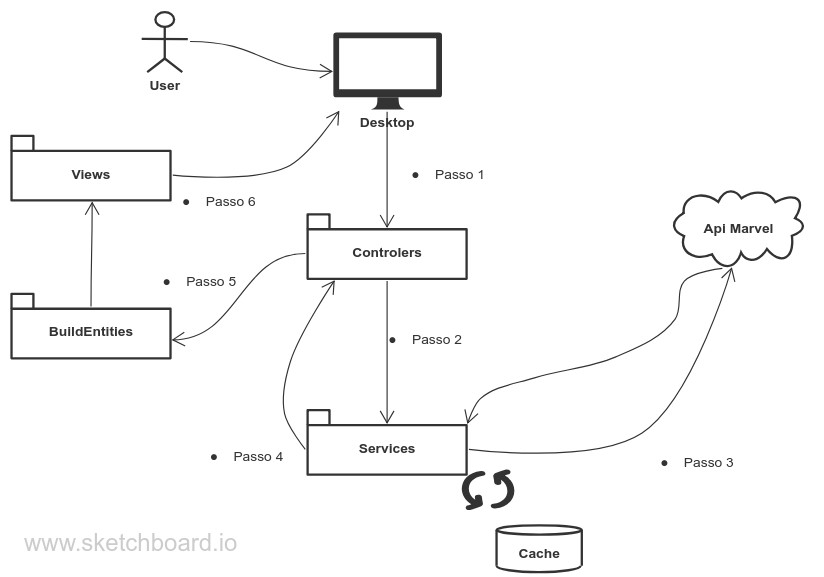

### Desafio Marvel
#### Descrição
Este projeto é a resolução de um desafio técnico para um processo seletivo, no qual o desafio era buscar por três herois favoritos e listar cinco histórias na quais cada um deles está incluso.
Para buscar os dados dos personagens foi utilizada a API da Marvel, para poder consultar a api é necessário [gerar o par de chaves publica e privada](https://developer.marvel.com/account), para esse procedimento é necessário ter uma conta na Marvel

#### Pré requisitos
Os itens abaixo serão necessários para poder instalar o projeto
* Chave pública da api da Marvel 
* Chave privada da api da Marvel 
* Ter o [Docker](https://docs.docker.com/install/linux/docker-ce/debian/) na máquina que irá subir o projeto.
* Ter o [Docker Compose](https://docs.docker.com/compose/install/) na máquina que irá subir o projeto.
* Por default o container irá utilizar a porta 8000 da máquina aonde o projeto irá rodar, então é necessário que está porta esteja liberada.  

#### Instalação
Tendo os pré-requisitos preenchidos, para a instalação é necessário seguir os seguintes passos:

1. Substituir a variável API_PUBLIC_KEY no arquivo .env pela sua chave de api publica.
2. Substituir a variável API_PRIVATE_KEY no arquivo .env pela sua chave de api privada. 
3. Rodar o comando abaixo para subir os containers necessários: 
```sh
$ docker-compose up -d
```
3. Rodar o comando abaixo para instalar as dependências do projeto: 
```sh
$ docker run --rm --interactive --tty --volume $PWD:/app composer install --ignore-platform-reqs
```

Após efetuar esses passos, acessar o seguinte endereço em seu navegador: http://localhost:8000
 
#### Descrição arquitetural

Em uma primeira análise, foi verificado que não haveria necessidade de incluir um backend para o desenvolvimento do projeto, devido a já existir uma api disponivel com todos os dados necessários.
Porém como a vaga do processo seletivo é para fullstack e o meu foco é mais em backend, então optei por incluir um backend feito em PHP e utilizando o framework [Symfony](https://symfony.com) para fins de aprender mais sobre o mesmo durante o desenvolvimento.
Para o frontend foi utilizado o [Twig](https://twig.symfony.com/) para servir as páginas html, no qual já possui integração com o Symfony.

O projeto foi dividido em quatro camadas:
* Controllers: Responsável por receber as entradas do usuário.
* Services: Responsáveis por buscar os dados de fora do sistema.
* Entitys: Responsáveis por representar os dados trazidos de fora em objetos dentro do sistema.
* Views: Templates que formatam as páginas retornadas para o usuário.
 
A arquitetura do projeto ficou como apresentado na imagem abaixo:



##### Descrição dos passos
1. O usuário requer uma página para a aplicação, essa requisição é enviada para o controller.
2. O controller redireciona a busca para o seu respectivo serviço de acordo com a entidade que está sendo consultada.
3. O serviço primeiramente verifica se o resultado da consulta está armazenado no cache, caso esteja então o cache é retornado, se não estiver então o serviço consulta a api da Marvel e salva o seu retorno em cache para que possa ser utilizado nas demais consultas.
4. Serviço retorna os dados para o controller.
5. Controller encaminha o retorno para os builders.
6. Builders criam as entidades que serão utilizadas nos templates.
